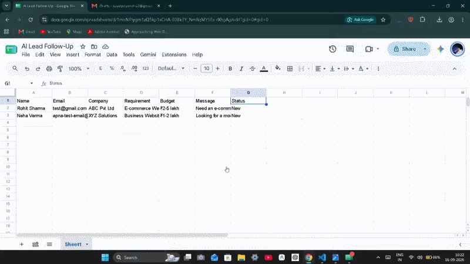
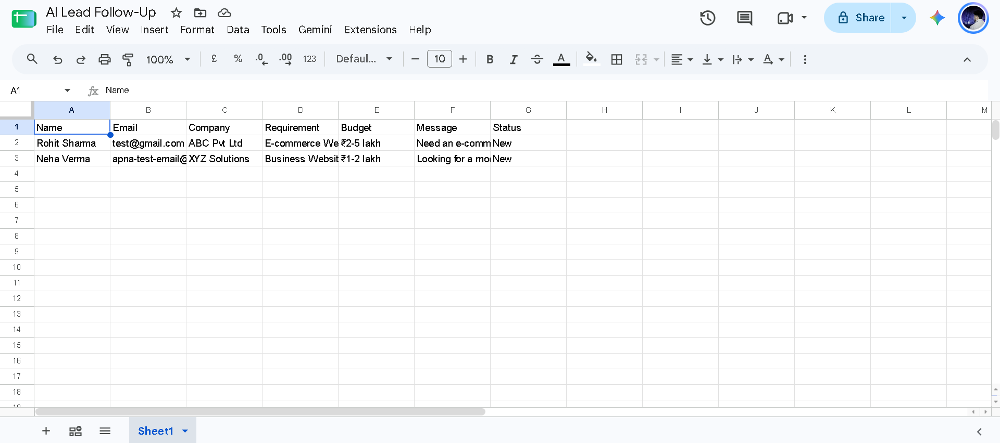
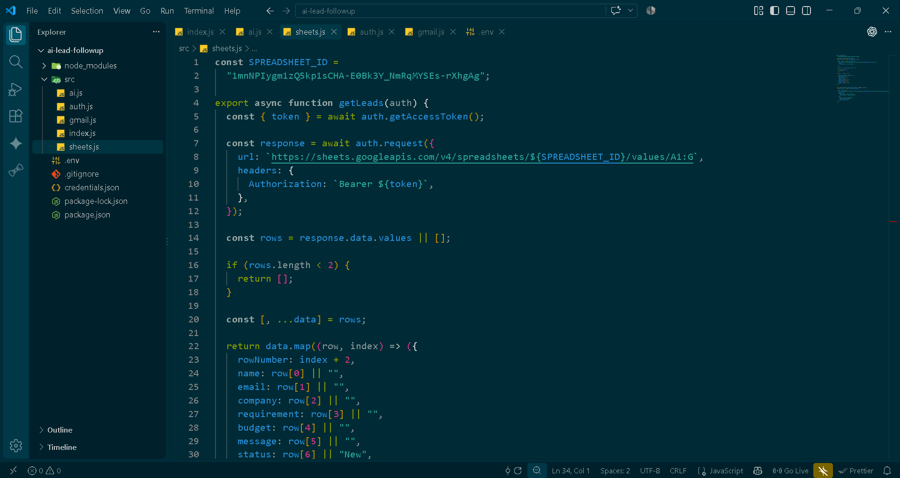
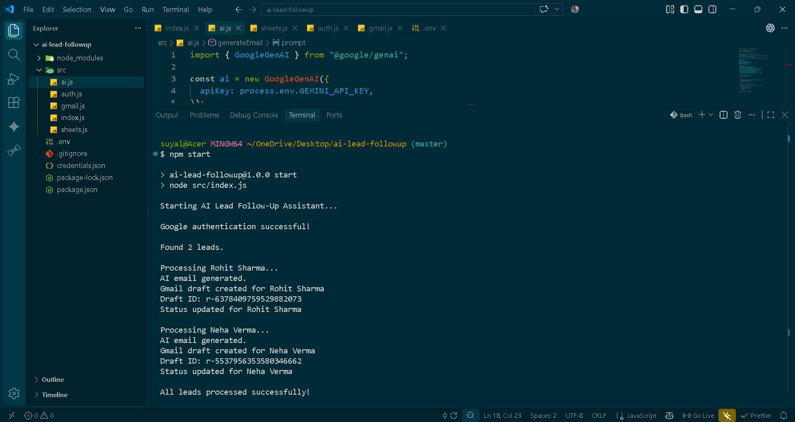
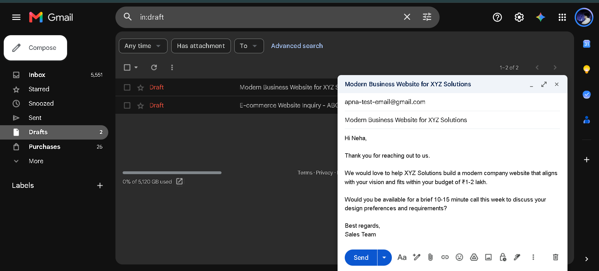
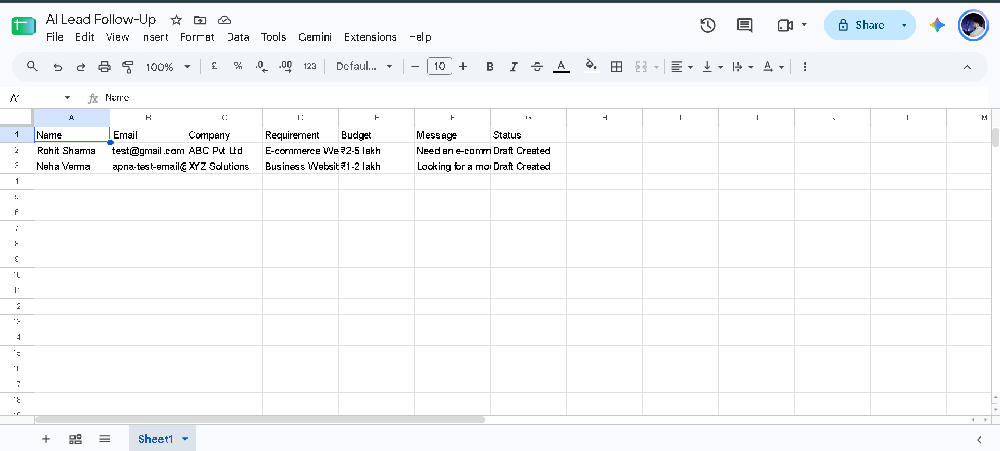

# AI Lead Follow-Up Assistant

An AI-powered lead follow-up automation that reads new leads from Google Sheets, generates personalized follow-up emails using Gemini, and creates Gmail drafts for human review.



## Overview

Following up with leads quickly is important for businesses, but manually writing personalized emails for every lead can be time-consuming.

This project automates the repetitive part of the process while keeping a human in the loop.

The system:

* Reads new leads from Google Sheets
* Uses Gemini to understand the lead's requirement
* Generates a personalized follow-up email
* Creates a Gmail draft instead of sending automatically
* Updates the lead status after processing

## Workflow

```text
Google Sheets
     ↓
Node.js Automation
     ↓
Gemini API
     ↓
Personalized Email
     ↓
Gmail Draft
     ↓
Human Review
     ↓
Status Updated
```

## Key Features

* Google Sheets API integration
* Gemini-powered personalized email generation
* Gmail API integration
* Automatic Gmail draft creation
* Lead processing based on status
* Prevents already-processed leads from being processed again
* Human-in-the-loop workflow
* Environment variable based configuration
* Simple Node.js automation without visual workflow builders

## Tech Stack

* Node.js
* Google Sheets API
* Gmail API
* Gemini API
* Google OAuth 2.0
* JavaScript

## Project Structure

```text
ai-lead-followup/
│
├── src/
│   ├── ai.js
│   ├── auth.js
│   ├── gmail.js
│   ├── index.js
│   └── sheets.js
│
├── screenshots/
├── demo/
├── .env
├── .gitignore
├── package.json
└── README.md
```

## How It Works

### 1. Lead Input

Leads are stored in Google Sheets with information such as:

* Name
* Email
* Company
* Requirement
* Budget
* Message
* Status

New leads are marked as `New`.

### 2. Lead Processing

The Node.js application reads the spreadsheet and identifies new leads.

Already processed leads with the status `Draft Created` are skipped.

### 3. AI Email Generation

The lead information is sent to Gemini with instructions to generate a short, relevant and personalized follow-up email.

The generated response contains:

* Email subject
* Email body

### 4. Gmail Draft Creation

The generated email is converted into a Gmail draft using the Gmail API.

The system does not automatically send the email.

This allows a human to review and edit the message before sending it.

### 5. Status Update

After successfully creating the Gmail draft, the lead's status is updated from:

```text
New
```

to:

```text
Draft Created
```

This prevents the same lead from being processed repeatedly.

## Example

### Lead

```text
Name: Neha Verma
Company: Example Technologies
Requirement: Website development
Budget: $5,000
Message: We are looking for a team to build a business website.
```

### AI Generated Follow-Up

Gemini generates a personalized email based on the lead's requirement and information.

The email is then saved as a Gmail draft for human review.


## Screenshots

### Google Sheets Lead Data



### Google Sheets API Integration



### Gemini AI Integration


### Automation Running



### Gmail Draft Created



### Lead Status Updated




## Security

Sensitive credentials are not committed to the repository.

The following files are excluded using `.gitignore`:

```text
.env
credentials.json
token.json
node_modules/
```

API keys and OAuth credentials should always be stored securely as environment variables or local credential files.

## Future Improvements

* Connect a website lead form directly to the workflow
* Add lead scoring and prioritization
* Add CRM integration
* Add follow-up reminders
* Add email response tracking
* Add analytics for lead conversion and follow-up performance

## What I Learned

This project helped me understand how AI can be combined with external APIs to automate a real business workflow while keeping humans involved in important decisions.

The main focus was not fully autonomous email sending, but creating a practical human-in-the-loop automation that reduces repetitive work.